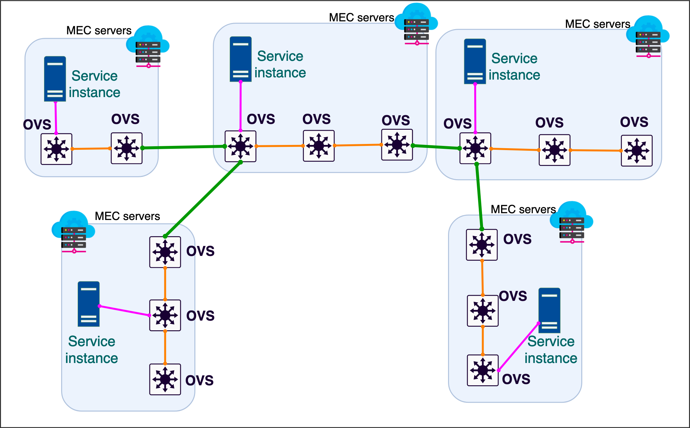

# SDN-based Service Discovery and Assignment Framework to Preserve Service Availability in Telco-based Multi Access Edge Computing

SDN-based dynamic service discovery and
assignment framework for a distributed MEC infrastructure. The framework was written in three programming languages.

-Java (for ONOS SDN controller)

-Python (for UE mobility model)

-Bash script (for server utilization monitoring)

## Simple scenario implementation using XeniumNFV testbed

## Mobility Model
A short demo of mobility model where UE (such as cars) moves from one MEC server to another

## How to run the framework
1- Create and run a Docker container for the Httperf tool as UE

2- Create and run a Docker container for the Microsoft Ethr client tool as UE

3- Run the Java files of the framework inside of the ONOS SDN controller (the code runs the decision-making unit, link status, service profile, and UE location monitoring unit)

4- Implement the SDN network topology in the topology folder by using the XeniumNFV testbed.

5- Run the Mobility model python file

6- Run the server utilization monitoring unit

