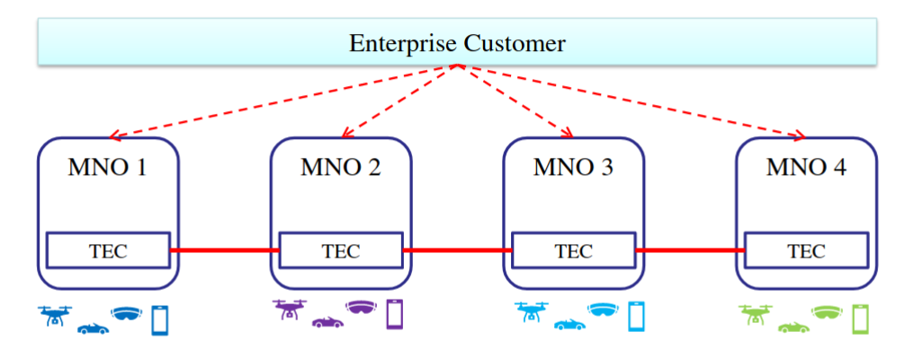
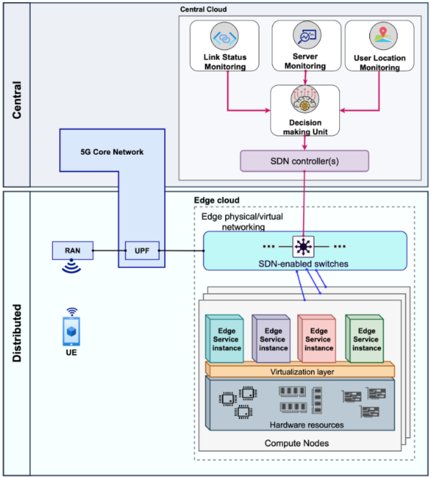
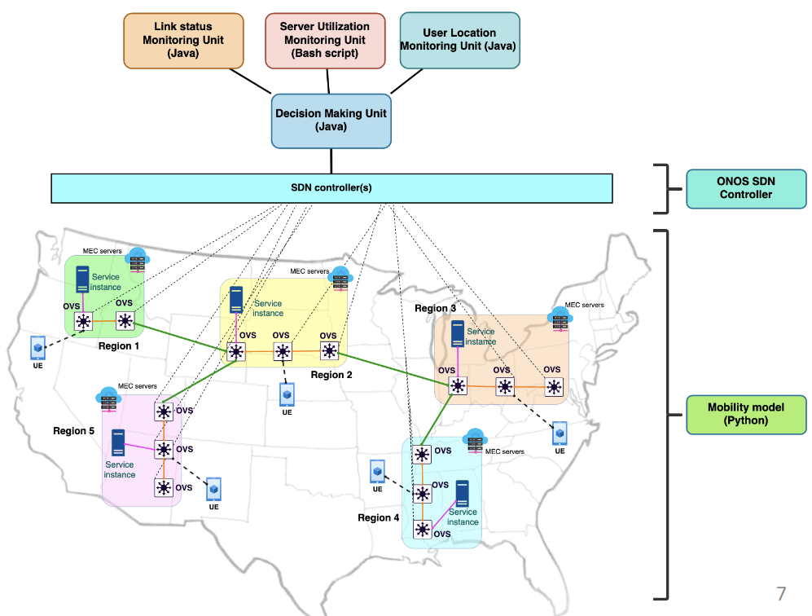
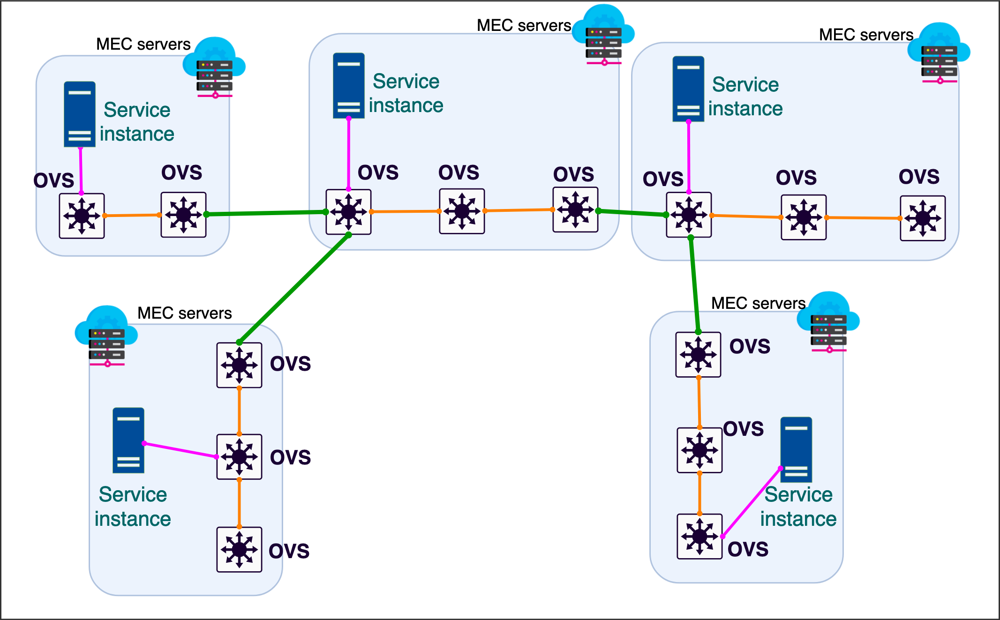

Last Update on Jul 17, 2022


## Project Title:
SDN-based Service Discovery and Assignment Framework to Preserve Service Availability in Telco-based Multi Access Edge Computing [[1]](#1)

## Project Description:
In March 2020, 19 operators launched the GSMA [Telco Edge Cloud](https://www.gsma.com/futurenetworks/telco-edge-cloud-forum/) (TEC) initiative to design and develop a global edge computing service based on the federation of edge infrastructures and platforms from a set of operators and edge service providers.



The TEC initiative has already produced impressive [results](https://www.gsma.com/futurenetworks/wp-content/uploads/2022/03/GSMA-TEC-Value-Whitepaper-v13.pdf) by showcasing edge applications such as [drone orchestration](https://www.gsma.com/futurenetworks/resources/telefonica-and-bt-telco-edge-cloud/), [Cloud XR gaming](https://drive.google.com/file/d/1Ijsrhu4g_iWgk8Gq3KqMgYV3Gyf8beLl/view), [AR-based virtual human guide](https://www.gsma.com/futurenetworks/latest-news/kddi-dt-and-partners-next-generation-ar-mobile-app/), [holographic video conference](https://www.gsma.com/futurenetworks/wp-content/uploads/2021/09/TEC-Forum-Europe-Update-Jul-2021.pdf), or [Cellular Vehicle-to-Everything (C-V2X) assisted driving](https://youtu.be/SYClLpQuBX8) across multiple operators and countries, demonstrating the feasibility and flexibility of edge federation mechanisms.

## Challenge Description:
The GSMA identified Service Discovery & Mobility as one of the TEC Platform's Minimum Viable Product (MVP) features. The dynamic assignment and reassignment of an Edge Node resource, as well as app instantiation for a specific customer requesting its use, are carried out based on the user's location and the app's requirements. Previously, 3GPP listed Edge Application Server Discovery and Relocation as top key issues for supporting Edge Computing in 5G Core Networks [[TR 23.748](https://portal.3gpp.org/desktopmodules/Specifications/SpecificationDetails.aspx?specificationId=3622)]. To support the efficient discovery of Edge Application Sever, the following aspects shall be studied in particular:
-	How can a UE discover a suitable Edge Application Server to serve the application/UE?
-	Consider scenarios (if any) for which the UE needs to be aware that there is an application server in the Edge Hosting Environment and scenarios (if any) for which the UE does not need to be aware that there is an application server in the Edge Hosting Environment.
-	What information (if any) can be used to assist such a discovery mechanism?
-	Whether and if yes how to support UE rediscovery of Edge Application Server when the previous Edge Application Server becomes non-optimal or unavailable to the UE?

The following scenarios of UE mobility and application server relocation shall be investigated:
- Change of the serving Edge Application Server with no change of Data Network Access Identifier (DNAI). This includes:
  - Change of the Edge Application Server e.g. due to the serving Edge Application Server becoming congested or being in outage condition.
- Change of the DNAI depending on the location of the UE to better serve the UE.

## Proposed Solution:
This project proposes the following SDN-based framework for dynamic service discovery and assignment in a distributed Edge Computing Infrastructure.



The framework comprises the following components:
1. Server monitoring unit (written in Bash script): observes the loading conditions on the Edge servers.
2. Link status monitoring unit (written in Java): observes the background traffic through user plane links.
3. User location monitoring unit (written in Java): tracks an up-to-date information of users' locations.
4. Decision making unit(written in Java as a custom application for the ONOS SDN controller): calculates the optimal allocation of Edge service instances. It satisfy the following requirements for each service assignment:
   1. required compute resources
   2. maximum allowable end-to-end delay
   3. User's location and Edge node affinity requirements
5. Users mobility model (written in Python): simulates the users' arrivals, departures, and speeds and visited regions. The users are modelled as Docker containers connecting and disconnecting from a network of Open vSwitches (OvS).   

The framework is fully in compliance with the SDN three layers architecture as shown below.



## How to Use the Framework
1. Create and run Docker containers for the Httperf and the Microsoft Ethr client tools to simulate the users.

2. Run the two Java files in [ONOS](https://github.com/nephilimboy/SDN_based_Service_Discovery_and_Assignment_Framework/tree/main/ONOS) to lunch the framework inside of the ONOS SDN controller[^*]. These files run the link status monitoring, service profile, and user location monitoring, and the decision-making units.

3. Implement the SDN network topology using the [XeniumNFV Platform](https://gitlab.com/nephh/XeniumNFV).
  E.g., For the network topology shown below, the SDN network shall be implemented by providing the ```Topology.xnet``` file in [XeniumNFV topology](https://github.com/nephilimboy/SDN_based_Service_Discovery_and_Assignment_Framework/tree/main/XeniumNFV%20topology) to the XeniumNFV Platform as shown below.

  

  

4. Run the user mobility model[^*] using the Python file ```MobilityModel.py``` in [UE Mobility Model and Server Utilization](https://github.com/nephilimboy/SDN_based_Service_Discovery_and_Assignment_Framework/tree/main/UE%20Mobility%20Model%20and%20Server%20Utilization%20Monitoring%20Unit)
  

5. Run the server utilization monitoring unit using the Bash script ``` ServiceServerUtilizationMonitoringUnit.sh ``` in [UE Mobility Model and Server Utilization](https://github.com/nephilimboy/SDN_based_Service_Discovery_and_Assignment_Framework/tree/main/UE%20Mobility%20Model%20and%20Server%20Utilization%20Monitoring%20Unit)


## Citation:
If you find this project helpful to you, please consider citing it using the following BibTex entry:

<a id="1">[1]</a>
[SDN-based Service Discovery and Assignment Framework to Preserve Service Availability in Telco-based Multi-Access Edge Computing](https://ieeexplore.ieee.org/document/9798959/)
```
@inproceedings{ghorab2022sdn,
  title={{SDN-based Service Discovery and Assignment Framework to Preserve Service Availability in Telco-based Multi-Access Edge Computing}},
  author={Ghorab, Amirhossein and Abuibaid, Mohammed and St-Hilaire, Marc},
  booktitle={2022 IEEE 6th International Conference on Fog and Edge Computing (ICFEC)},
  pages={100--104},
  year={2022},
  organization={IEEE}
}
```

<a id="2">[2]</a>
[XeniumNFV: A Unified, Dynamic, Distributed and Event-Driven SDN/NFV Testbed](https://ieeexplore.ieee.org/document/8591037)
```
@inproceedings{kusedghi2018xeniumnfv,
  title={{XeniumNFV: A Unified, Dynamic, Distributed and Event-Driven SDN/NFV Testbed}},
  author={Kusedghi, Amir and Ghorab, Amirhossein and Akbari, Ahmad},
  booktitle={2018 IEEE International Conference on Cloud Computing Technology and Science (CloudCom)},
  pages={320--326},
  year={2018},
  organization={IEEE}
}
```

## Footnotes:
[^*]: Disclaimer: The provided code implements the examples given here, which also used in the experiments of [[1]](#1). To implement different scenarios, the Python ```MobilityModel.py``` code in [UE Mobility Model and Server Utilization](https://github.com/nephilimboy/SDN_based_Service_Discovery_and_Assignment_Framework/tree/main/UE%20Mobility%20Model%20and%20Server%20Utilization%20Monitoring%20Unit) and the framework Java codes in [ONOS](https://github.com/nephilimboy/SDN_based_Service_Discovery_and_Assignment_Framework/tree/main/ONOS) should be manually modified (i.e., comment or uncomment certain lines) based on the simulation parameters (e.g., IP Addresses and MTU).
